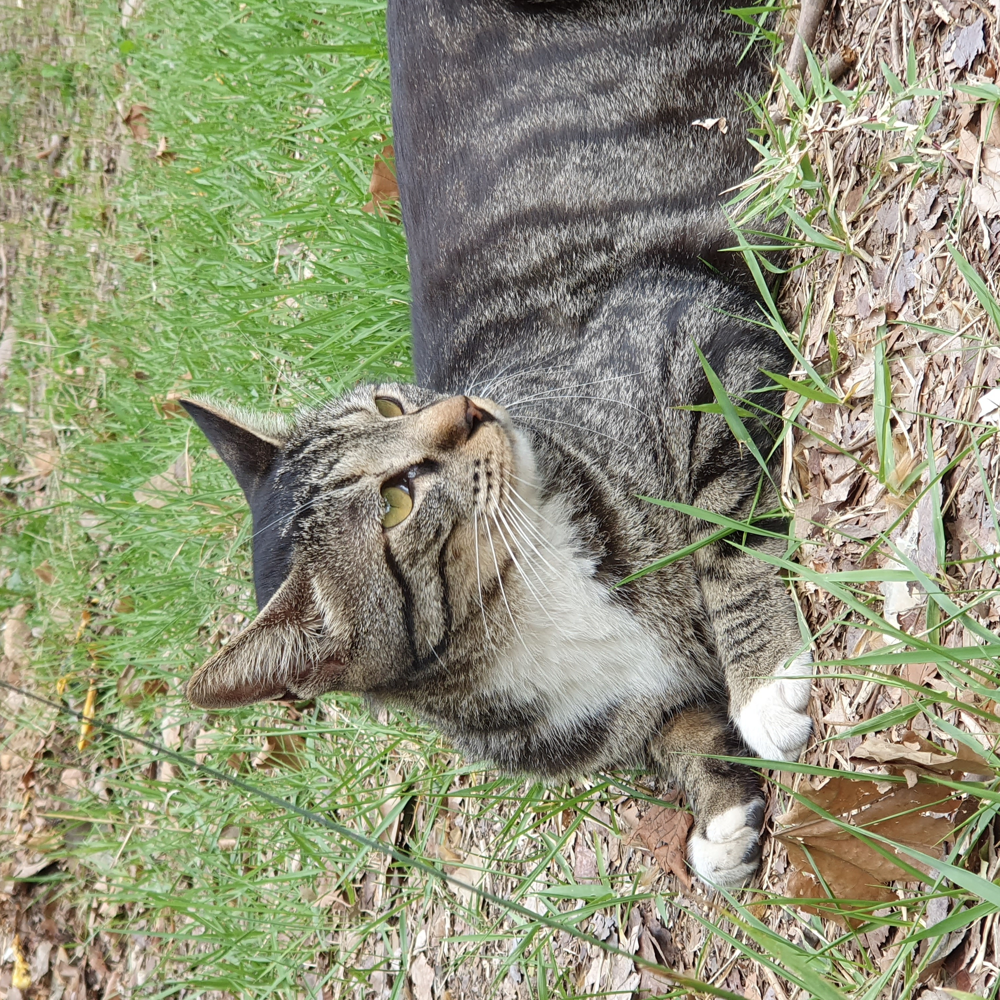
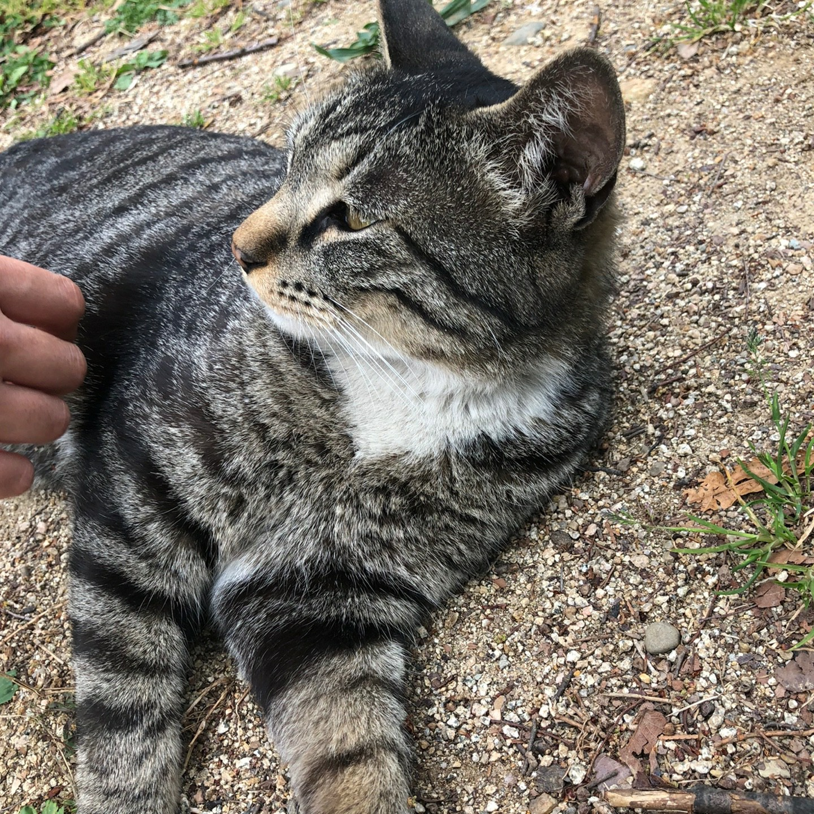
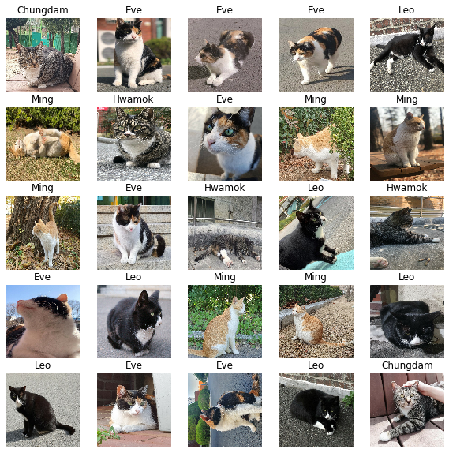
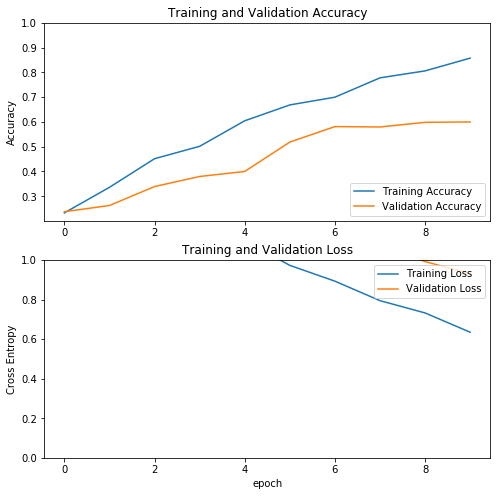

# 크냥이

**Convnet에서 전이학습 시키자**

[Transfer learning with a pretrained ConvNet | TensorFlow Core](https://www.tensorflow.org/tutorials/images/transfer_learning?hl=ko)

# Contents

1. [Requirements]()
2. [Datasets]()
3. [Load Images]()
4. [Transfer Learning]()
5. [Adaptation]()

## Requirements

1. tensorflow-gpu

   `conda install tensorflow-gpu`

2. tfds

   `conda install tfds`

3. matplotlib

   `conda install matplotlib`

4. jupyter lab + tqdm

   - ipywidgets

     `conda install -c conda-forge ipywidgets`

   - tqdm

     `conda install tqdm`

   - nodejs

     `conda install -c conda-forge nodejs`

     `jupyter labextension install @jupyter-widgets/jupyterlab-manager`

   - jupyter lab

     `conda install -c conda-forge jupyterlab`

5. pillow

   `conda install pillow`

## Datasets

[CasselKim/KnyangDataset](https://github.com/CasselKim/Knyang)

## Labeling knyang datasets

Tensorflow 2.0 버전이라 찾기 너무 힘들었다.

[[Tensorflow 2.0] Load Images to tensorflow](https://medium.com/@a.ydobon/tensorflow-2-0-load-images-to-tensorflow-897b8b067fc2)

[파이썬 pathlib 사용하기 - NO MORE os.path.join()](https://ryanking13.github.io/2018/05/22/pathlib.html#usage)

pathlib을 이용하여 로컬에 저장된 이미지를 긁어오자

### 1. 필요한 모듈을 임포트해줍니다.

```python
from __future__ import absolute_import, division, print_function, unicode_literals
import tensorflow as tf

import IPython.display as display
from PIL import Image 
import numpy as np
import matplotlib.pyplot as plt

import pathlib  
import time

# 효율적인 런타임 운용을 위함(experimental이라서 바뀔수도 있음)
AUTOTUNE=tf.data.experimental.AUTOTUNE
```

### 2. 이미지를 받습니다.

**온라인에서 받는 경우(예시)**

```python
path = tf.keras.utils.get_file(
	origin='https://storage.googleapis.com/download.tensorflow.org/example_images/flower_photos.tgz',
	fname='flower_photos', untar=True
)
path = pathlib.Path(path)
```

**로컬에 바로 받는 경우**

```python
path = pathlib.Path('./KnyangDataset')
files = len(list(path.glob('*/*/*.jpg')))
```

**확인**

```python
image_count = len(list(path.glob('*/*/*.jpg'))) # 이미지의 갯수 확인

'''
[Output]
500
'''
```

```python
print([item for item in path.glob('*/*')]) # 경로 확인

'''
[Output]
[WindowsPath('knyang/sets/Chungdam'),
 WindowsPath('knyang/sets/Eve'),
 WindowsPath('knyang/sets/Hwamok'),
 WindowsPath('knyang/sets/Leo'),
 WindowsPath('knyang/sets/Ming')]
'''
```

```python
CLASS_NAMES = np.array([item.name for item in path.glob('Test/*')]) # 클래스 확인

'''
[Output]
array(['Chungdam', 'Eve', 'Hwamok', 'Leo', 'Ming'], dtype='<U8')
'''
```

```python
chungdam = list(path.glob('Test/chungdam/*')) # 예시 출력
for image_path in chungdam[:3] :
    display.display(Image.open(str(image_path)))
```






### 3. 이미지를 전처리합니다

**하이퍼 파라미터 정의**

```python
BATCH_SIZE = 32
IMG_HEIGHT = 160
IMG_WIDTH = 160
```

**경로 리스트를 (무작위로) 받아옵니다**

```python
train_list_ds = tf.data.Dataset.list_files(str(path/'Train/*/*.jpg'))
validation_list_ds = tf.data.Dataset.list_files(str(path/'Validation/*/*.jpg'))
test_list_ds = tf.data.Dataset.list_files(str(path/'Test/*/*.jpg'))
```

```python
for f in train_list_ds.take(2) : 
    print(f)

'''
[Output]
tf.Tensor(b'KnyangDataset\\Train\\Chungdam\\1587034204110-16.jpg', shape=(), dtype=string)
tf.Tensor(b'KnyangDataset\\Train\\Eve\\20190602_190129.jpg', shape=(), dtype=string)
'''
```

**이미지를 받아올때 필요한 메소드들을 정의해줍니다**

```python
def get_label(file_path) : # 클래스를 라벨링
    parts = tf.strings.split(file_path,'\\') # 리눅스는 '/'
    index=0
    for i,c in enumerate(CLASS_NAMES) : 
        if c == parts[-2] : index=i
            
    return index  

def decode_img(img) : # jpeg로 포맷된 이미지를 디코딩
    img = tf.image.decode_jpeg(img, channels=3)
    img = tf.image.convert_image_dtype(img, tf.float32)
    return tf.image.resize(img, [IMG_WIDTH, IMG_HEIGHT])

def process_path(file_path) : # 경로에따라 이미지를 읽어 위의 메소드를 실행
    label = get_label(file_path)
    img = tf.io.read_file(file_path)
    img = decode_img(img)
    return img, label
```

**위의 메소드들을 이용해 라벨링 된 데이터셋을 받아옵니다**

```python
labeled_train_ds = train_list_ds.map(process_path, num_parallel_calls = AUTOTUNE)
labeled_validation_ds = validation_list_ds.map(process_path, num_parallel_calls = AUTOTUNE)
labeled_test_ds = test_list_ds.map(process_path, num_parallel_calls = AUTOTUNE)
```

```python
for image, label in labeled_train_ds.take(5) : 
    print("Image shape : ", image.numpy().shape)
    print("Label : ", label.numpy())

'''
[Output]
Image shape :  (160, 160, 3)
Label :  0
Image shape :  (160, 160, 3)
Label :  1
Image shape :  (160, 160, 3)
Label :  2
Image shape :  (160, 160, 3)
Label :  4
Image shape :  (160, 160, 3)
Label :  2
'''
```

**학습 전에 Batch size대로 데이터셋을 나눠줍니다**

```python
def prepare_for_training(ds, cache=True, shuffle_buffer_size=1000) : 
    if cache : 
        if isinstance(cache, str) : 
            ds = ds.cache(cache)
        else : 
            ds = ds.cache()
    
    ds = ds.shuffle(buffer_size=shuffle_buffer_size)
    ds = ds.repeat()
    ds = ds.batch(BATCH_SIZE)
    ds = ds.prefetch(buffer_size=AUTOTUNE)
    
    return ds
```

**나눠진 데이터셋을 이미지와 라벨로 나눠줍니다**

```python
train_ds = prepare_for_training(labeled_train_ds)
validation_ds = prepare_for_training(labeled_validation_ds)
test_ds = prepare_for_training(labeled_test_ds)

image_batch, label_batch = next(iter(train_ds))
```

### 4. 나눠진 데이터셋을 확인합니다.

**확인에 필요한 메소드를 정의해줍니다**

```python
def show_batch(image_batch, label_batch):
    plt.figure(figsize=(10,10))
    for n in range(25):
        ax = plt.subplot(5,5,n+1)
        plt.imshow(image_batch[n])
        plt.title(CLASS_NAMES[label_batch][n])
        plt.axis('off')
```

```python
show_batch(image_batch.numpy(), label_batch.numpy())
```



### (번외) 캐시에 따른 속도 비교

**속도를 측정하기 위한 메소드를 정의해줍니다**

```python
import time
default_timeit_steps = 1000
def timeit(ds, steps=default_timeit_steps):
    start = time.time()
    it = iter(ds)
    for i in range(steps):
        batch = next(it)
        if i%10 == 0:
            print('.',end='')
    print()
    end = time.time()
    
    duration = end-start
    print("{} batches: {} s".format(steps, duration))
    print("{:0.5f} Images/s".format(BATCH_SIZE*steps/duration))
```

1. 일반적으로 iteration을 진행할 때

   `timeit(train_ds)`

   → 1000 batches: 9.289300441741943 s, 3444.82345 Images/s

2. 셔플링+배치사이즈로 나눌 때 (캐시 비활성)

   `uncached_ds = prepare_for_training(labeled_ds, cache=False)`

   `timeit(uncached_ds)`

   → 1000 batches: 391.468891620636 s, 81.74340 Images/s

3. 셔플링+배치사이즈로 나눌 때(캐시 활성)

   `filecache_ds = prepare_for_training(labeled_ds, cache="./knyang/sets.tfcache")`

   `timeit(filecache_ds)`

   → 1000 batches: 35.10152530670166 s, 911.64130 Images/s

결론 : 캐시를 활성화시키는게 11배가까이 빠르다

## Transfer Learning

### 1. 모델을 불러옵니다

```python
IMG_SHAPE = (IMG_HEIGHT, IMG_WIDTH, 3) # input으로 들어갈 이미지 크기를 지정

# 모델을 로드(탑 부분을 제거한 이미지 넷의 파라미터를 가져옴)
base_model = tf.keras.applications.MobileNetV2(input_shape=IMG_SHAPE,
                                               include_top=False,
                                               weights='imagenet')

feature_batch = base_model(image_batch) # 이미지로부터 각 특징들을 뽑아냄
base_model.trainable = False # 파라미터들을 바꿀지 설정
base_model.summary() # 모델 요약 정보

'''
[Output]
Model: "mobilenetv2_1.00_160"
__________________________________________________________________________________________________
Layer (type)                    Output Shape         Param #     Connected to                     
==================================================================================================
.
.
.            
==================================================================================================
Total params: 2,257,984
Trainable params: 0
Non-trainable params: 2,257,984
__________________________________________________________________________________________________
'''
```

### 2. 추가하고자 하는 레이어를 정의합니다

**풀링** **레이어를 정의합니다(1280개의 특징들로 바꾸기 위한 레이어)**

```python
global_average_layer = tf.keras.layers.GlobalAveragePooling2D()
feature_batch_average = global_average_layer(feature_batch)
```

```python
print(feature_batch_average.shape)

''' 
[Output]
(32, 1280) -> 32장의 이미지, 각각 1280개의 특징
'''
```

**Dense 레이어를 정의합니다(클래스 분류를 위한 레이어)**

```python
prediction_layer = tf.keras.layers.Dense(5,activation='softmax')
prediction_batch = prediction_layer(feature_batch_average)
```

```python
print(print(prediction_batch.shape))

'''
[Output]
(32, 5) -> 32장의 이미지, 각각 5개의 클래스
'''
```

**받아온 모델위에 풀링 레이어, Dense 레이어를 올려서 모델을 재구성합니다.** 

```python
model = tf.keras.Sequential([
    base_model,
    global_average_layer,
    prediction_layer
])
```

```python
base_learning_rate = 0.0001
model.compile(optimizer=tf.keras.optimizers.Adam(learning_rate=base_learning_rate,name='Adam'),
              loss = tf.keras.losses.SparseCategoricalCrossentropy(),
              metrics=['accuracy'])
```

```python
model.summary()

'''
[Output]
Model: "sequential"
_________________________________________________________________
Layer (type)                 Output Shape              Param #   
=================================================================
mobilenetv2_1.00_160 (Model) (None, 5, 5, 1280)        2257984   
_________________________________________________________________
global_average_pooling2d (Gl (None, 1280)              0         
_________________________________________________________________
dense (Dense)                (None, 5)                 6405      
=================================================================
Total params: 2,264,389
Trainable params: 6,405
Non-trainable params: 2,257,984
_________________________________________________________________
'''
```

```python
len(model.trainable_variables)

'''
[Output]
2 -> 학습가능한 변수 : 2개의 w(weight)와 b(bias)
'''
```

### 3. 데이터셋과 모델로 학습합니다

**시험학습**

```python
initial_epochs = 10
validation_steps = 20

loss0, accuracy0 = model.evaluate(validation_ds,
                                 steps = validation_steps)
```

```python
print("initial loss: {:.2f}".format(loss0))
print("initial accuracy: {:.2f}".format(accuracy0))

'''
[Output]
initial loss: 2.30
initial accuracy: 0.10
'''
```

**실제 학습(trainable = False)**

```python
history = model.fit(train_ds,
                   epochs = initial_epochs,
                   validation_data=validation_ds,
                   steps_per_epoch=20,

                   validation_steps = validation_steps)

'''
[Output]
Train for 20 steps, validate for 20 steps
Epoch 1/10
20/20 [==============================] - 3s 161ms/step - loss: 1.8150 - accuracy: 0.2328 - val_loss: 2.0826 - val_accuracy: 0.2375
.
.
.
20/20[==============================] - 1s 40ms/step - loss: 0.6353 - accuracy: 0.8578 - val_loss: 0.9314 - val_accuracy: 0.6000
'''
```

```python
acc = history.history['accuracy']
val_acc = history.history['val_accuracy']

loss = history.history['loss']
val_loss = history.history['val_loss']

plt.figure(figsize=(8, 8))
plt.subplot(2, 1, 1)
plt.plot(acc, label='Training Accuracy')
plt.plot(val_acc, label='Validation Accuracy')
plt.legend(loc='lower right')
plt.ylabel('Accuracy')
plt.ylim([min(plt.ylim()),1])
plt.title('Training and Validation Accuracy')

plt.subplot(2, 1, 2)
plt.plot(loss, label='Training Loss')
plt.plot(val_loss, label='Validation Loss')
plt.legend(loc='upper right')
plt.ylabel('Cross Entropy')
plt.ylim([0,1.0])
plt.title('Training and Validation Loss')
plt.xlabel('epoch')
plt.show()
```



### 4. trainable한 모델을 구성합니다

**trainable할 레이어의 범위를 지정합니다**

```python
base_model.trainable = True

# 베이스 모델에 몇개의 레이어가 있는지 확인합니다
print("Number of layers in the base model: ", len(base_model.layers)) # 155개

# 몇번째 레이어부터 fine_tune을 할지 지정합니다
fine_tune_at = 100

# fine_tune_at 레이어 전의 레이어들이 학습되지 않도록 잠급니다
for layer in base_model.layers[:fine_tune_at]:
	layer.trainable =  False
```

**다시 모델을 컴파일합니다**

```python
base_learning_rate = 0.0001
model.compile(optimizer=tf.keras.optimizers.Adam(learning_rate=base_learning_rate,name='Adam'),
              loss = tf.keras.losses.SparseCategoricalCrossentropy(),
             metrics=['accuracy'])
```

```python
model.summary()

'''
[Output]
Model: "sequential"
_________________________________________________________________
Layer (type)                 Output Shape              Param #   
=================================================================
mobilenetv2_1.00_160 (Model) (None, 5, 5, 1280)        2257984   
_________________________________________________________________
global_average_pooling2d (Gl (None, 1280)              0         
_________________________________________________________________
dense (Dense)                (None, 5)                 6405      
=================================================================
Total params: 2,264,389
Trainable params: 1,868,997
Non-trainable params: 395,392
_________________________________________________________________
'''
```

```python
len(model.trainable_variables)

'''
[Output]
58 -> 학습가능한 변수 : 58개의 w(weight)와 b(bias)
'''
```

### 5. 학습을 계속 진행합니다

**위에서 진행했던 부분 다음부터 학습을 진행합니다(trainable = True)**

```python
fine_tune_epochs = 10
total_epochs =  initial_epochs + fine_tune_epochs

history_fine = model.fit(train_ds,
                         epochs=total_epochs,
                         initial_epoch =  history.epoch[-1],
                         validation_data=validation_ds,
                         steps_per_epoch=20,
                         validation_steps = validation_steps)

'''
[Output]
Train for 20 steps, validate for 20 steps
Epoch 10/20
20/20 [==============================] - 5s 273ms/step - loss: 0.2564 - accuracy: 0.9406 - val_loss: 0.3467 - val_accuracy: 0.8609
.
.
.
20/20 [==============================] - 1s 49ms/step - loss: 0.0017 - accuracy: 1.0000 - val_loss: 0.4287 - val_accuracy: 0.8391
'''
```

~~데이터셋이 너무적어서 오버피팅됬다~~

### 6. 테스트를 진행합니다

```python
x_test, y_test = next(iter(test_ds))
model.evaluate(x_test,y_test,verbose=1)

'''
[Output]
32/32 [==============================] - 1s 23ms/sample - loss: 0.3692 - accuracy: 0.8125
'''
```

## Adaptation

### 1. 프로토타입을 만들어봅시다

**필요한 모듈을 추가로 받아옵니다**

```python
from PIL import Image, ImageOps
import matplotlib.pyplot as plt
```

**이미지를 받아옵니다**

```python
chungdam = Image.open('chungdam03.jpg')
eve = Image.open('eve02.jpg')
hwamok = Image.open('hwamok02.jpg')
leo = Image.open('leo02.jpg')
ming = Image.open('ming02.jpg')
```

**이미지를 사이즈에 맞게 전처리합니다**

```python
size = (160, 160)

chungdam = np.asarray(chungdam.resize(size))
eve = (np.asarray(eve.resize(size)).astype(np.float32) / 127.0) - 1
hwamok = (np.asarray(hwamok.resize(size)).astype(np.float32) / 127.0) - 1
leo = (np.asarray(leo.resize(size)).astype(np.float32) / 127.0) - 1
ming = (np.asarray(ming.resize(size)).astype(np.float32) / 127.0) - 1
```

**모델에 넣기 좋게 타입을 맞춥니다**

```python
c = np.ndarray(shape=(1, 160, 160, 3), dtype=np.float32)
e = np.ndarray(shape=(1, 160, 160, 3), dtype=np.float32)
h = np.ndarray(shape=(1, 160, 160, 3), dtype=np.float32)
l = np.ndarray(shape=(1, 160, 160, 3), dtype=np.float32)
m = np.ndarray(shape=(1, 160, 160, 3), dtype=np.float32)

c[0] = chungdam
e[0] = eve
h[0] = hwamok
l[0] = leo
m[0] = ming
```

**모델을 통과시키고 퍼센트로 포맷을 맞춥니다**

```python
pc = np.uint(model.predict(c)[0]*100)
pe = np.uint(model.predict(e)[0]*100)
ph = np.uint(model.predict(h)[0]*100)
pl = np.uint(model.predict(l)[0]*100)
pm = np.uint(model.predict(m)[0]*100)
```

**출력**

```python
print("청담 : {}% \t 이쁜이 : {}% \t 화목 : {}% \t 레오 : {}% \t 슘밍(짭담) : {}%".format(pc[0],pc[1],pc[2],pc[3],pc[4]))
print("청담 : {}% \t 이쁜이 : {}% \t 화목 : {}% \t 레오 : {}% \t 슘밍(짭담) : {}%".format(pe[0],pe[1],pe[2],pe[3],pe[4]))
print("청담 : {}% \t 이쁜이 : {}% \t 화목 : {}% \t 레오 : {}% \t 슘밍(짭담) : {}%".format(ph[0],ph[1],ph[2],ph[3],ph[4]))
print("청담 : {}% \t 이쁜이 : {}% \t 화목 : {}% \t 레오 : {}% \t 슘밍(짭담) : {}%".format(pl[0],pl[1],pl[2],pl[3],pl[4]))
print("청담 : {}% \t 이쁜이 : {}% \t 화목 : {}% \t 레오 : {}% \t 슘밍(짭담) : {}%".format(pm[0],pm[1],pm[2],pm[3],pm[4]))

'''
[Output]
청담 : 2% 	 이쁜이 : 2% 	 화목 : 88% 	 레오 : 5% 	 슘밍(짭담) : 1%
청담 : 0% 	 이쁜이 : 90% 	 화목 : 8% 	 레오 : 0% 	 슘밍(짭담) : 0%
청담 : 4% 	 이쁜이 : 0% 	 화목 : 89% 	 레오 : 4% 	 슘밍(짭담) : 0%
청담 : 0% 	 이쁜이 : 5% 	 화목 : 0% 	 레오 : 93% 	 슘밍(짭담) : 0%
청담 : 0% 	 이쁜이 : 0% 	 화목 : 0% 	 레오 : 0% 	 슘밍(짭담) : 99%
'''
```

청담이와 화목이는 거의 구분못함
그나마 정면샷이 가장 정확도가 올라가는편

## 2. Opencv와 연동해봅시다


